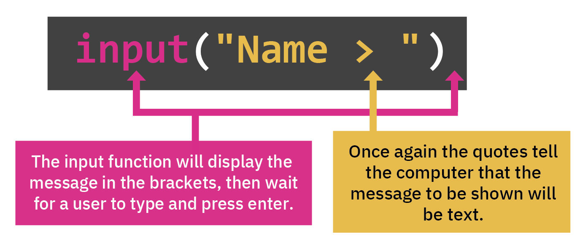

# Taking user input

## Input 

Let's take a look at the `input` command and how that works. Input is when the user gives information to the computer.



It's very similar to the `print` command, except that it'll show the message in the console ***then wait*** until the user has typed something into the console and pressed enter. Let's try it!

&nbsp;

👉 Copy this code into your coding editor in `main.py` and see what happens when you hit `run`:


```python
input("What's your name?: ")
```
