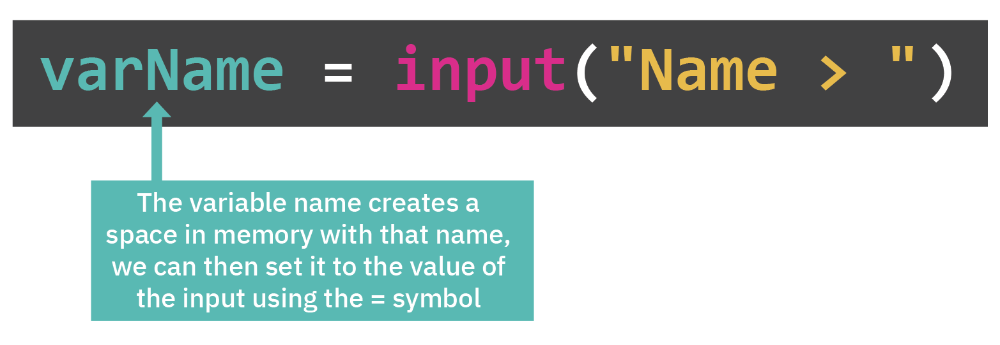

# Variables

## What is a variable?
`input` asks for something, takes it, but then has nowhere to put it. We can change that with a `variable` which is a value that we can use to name and store data. (Remember, David's box for David's phone?)



## Naming variables
- You can give a variable any name you want, but **you can't use spaces**. You can use:
  - underscores_between_words
  - camelCaseToMakeItEasierToRead

👉 Delete all your code and copy this into your code editor in the `main.py` file:

```python
myName = input("What's you name?: ")
myAge = input("How old are you? :")
print("Gee, that's REALLY OLD")
replit = input("Do you like Replit?")
print("OF COURSE YOU DO!")
```

- We now have ***three*** variables:
  - `myName` has the user's name in it
  - `myAge` is storing their age
  - `replit` is storing their feelings about this amazing website.

&nbsp;

### Now, what do we do with this?


