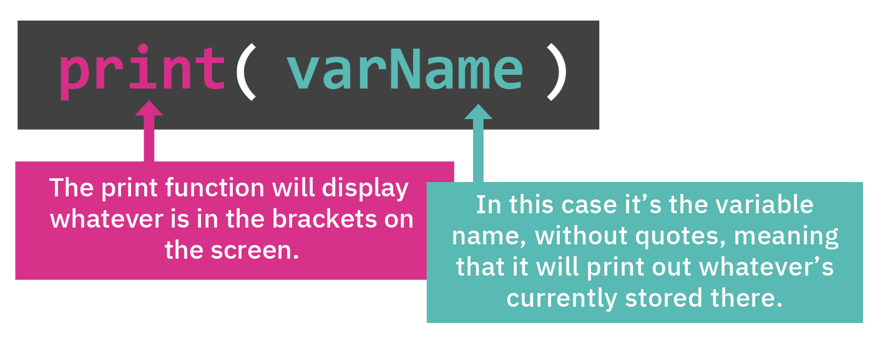

# Printing a Variable

You can print your variable using `print` and the name you used for your variable in your `input` command. Remember the three variables we just created: `myName`, `myAge` and `replit`? 

In your code you can now print 'name' by using `print(myName)` or 'age' by using `print(myAge)`.




&nbsp;

👉 Let's try it! Try adding this code to the end of what you've got and hit `run`:

```python
print()
print("So, you are")
print(myName)
print("and are the ripe old age of")
print(myAge)
print("and clearly think that Replit is")
print(replit)
```


 Did you notice what `print()` did?
  - if there is text inside `()` the text is printed
  - if there is nothing inside the `()` then a blank line is added for a bit of space
    


### This code **looks a little funky** at the moment. We will make this look better tomorrow.

